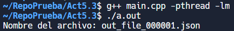
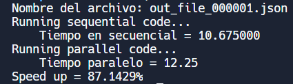

# Resaltador de sintaxis - Versión C++ 

## Ejecución del programa
* Compila el programa con el comando:  
`g++ main.cpp -pthread -lm ` seguido de `./a.out`
* Al correr el archivo, el programa le pedirá que escriba el nombre del archivo en el que desea utilizar el resaltador de sintaxis. Puede probar con `example_0.json
* Al terminar la ejecucion podra ver los resultados HTML como: "sequencial.html" y "paralelo.html".

Ejemplo: 

* NOTA: Se pueden cambiar manualmente el numero de threads desde el main.cpp 

# 

## Tiempo de ejecucion y speed up

#
## Complejidad
La complejidad del algoritmo se tiene que medir tomando en cuenta las siguientes funciones:
* Lectura del archivo: O(n)
* Escritura del archivo: O(n)
* Asignación de clases: O(n)
* Uso de hilos: O(n)

Con lo anterior, vemos que la complejidad total del programa es O(n*m), ya que gracias al uso de threads, la cantidad de
repeticiones en la asignación de las clases y en la escritura del archivo irá variando según la cantidad de hilos que se utilicen.

#
## Conclusiones
En la implementación de esta actividad, pudimos notar cómo existe una gran diferencia en tiempos de ejecución cuando se aprovechan múltiples núcleos disponibles en los CPU’s modernos a comparación de cuando no se aprovecha y se realiza todo en uno mismo de forma sincrónica.