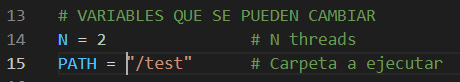
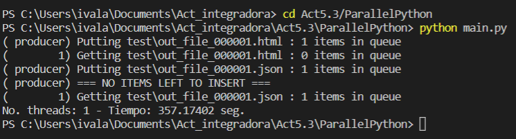
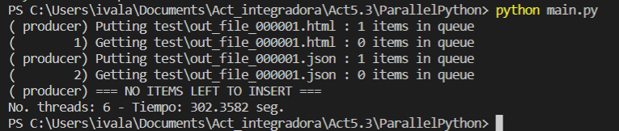

# Resaltador de sintaxis paralelo en python 

## Intrucciones para correr: 
1. Dentro de python, asegurarse de tener pip con: pip -h 
2. Ejecutar el comando pip install virtualenv 
3. Seguir con el comando virtualenv venv 
4. Y finalmente el comando pip install -r requirements.txt 
5. Correr el main para ver los resultados con python main.py 
6. Los resultados se reflejaran en la carpeta "test" 

* NOTA: Para cambiar el numero de Threads es necesario cambiarlo desde main.py en N = [numero de threads] 

## Comparación entre threads

* Un solo thread

* 6 threads

#### Speedup obtenido = 1.18  

## Complejidad: 
Por las iteraciones sobre cada linea del archivo y además de la función while que analiza las lineas, es de complejidad O(n´2)

## Reflexiones: 
La implementación de lectura por hilos, mejora la lectura de varios archivos en menor tiempo, aprovechado los procesadores actuales, resultando en una ejecución mas rapida. 

Como tal, en el proyecto no podemos notar implicaciones eticas, pero quizas si existan problemas con la ejecucion de tareas paralelas, por ejemplo, si alguien esta intentando ingresar a un sistema de forma ilegal, el uso de ejecuciones paralelas le podria facilitar el ingreso en menos tiempo y hasta salir del sistema antes de ser detectado. 